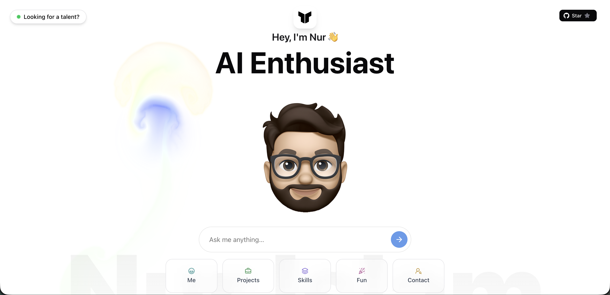

# Nur's AI Portfolio

**Static portfolios are dead.**
So I built [mdnurislam.com](https://mdnurislam.com).

Instead of making you scroll endlessly, my portfolio adapts to *you*.
Ask a question — my AI avatar replies instantly.

## About Me

I'm **Md. Nur Islam** — a full-stack developer specializing in AI, based in Sydney, Australia (originally from Dhaka, Bangladesh).

- BSc in CSE from AIUB — CGPA 3.99/4.00, **Summa Cum Laude**
- Master's in Artificial Intelligence (Cybersecurity major) at Western Sydney University
- 3+ years of software engineering experience at Pipilika Soft
- Currently building with WordPress plugins and managing Ubuntu/WHM/cPanel servers

## What can you ask?

- **Tech recruiter?** Ask about my stack & experience
- **Developer?** Dive into my code & projects
- **Curious?** Ask anything about me, my skills, or my journey

## Tech Stack

**Frontend:** React, Next.js, TypeScript, Tailwind CSS, Framer Motion

**Backend:** Node.js, PHP (Laravel), ASP.NET MVC5, REST APIs, Python

**Databases:** MS SQL Server, MySQL, MongoDB, PostgreSQL, Oracle

**Other:** GitHub, Figma, Ubuntu/WHM/cPanel server management

## How to Run

### Prerequisites
- **Node.js** (v18 or higher)
- **npm** package manager
- **OpenAI API token** (for AI chat functionality)
- **GitHub token** (for GitHub integration features)

### Setup
1. **Clone the repository**
   ```bash
   git clone https://github.com/nursm86/ai_portfolio.git
   cd ai_portfolio
   ```

2. **Install dependencies**
   ```bash
   npm install --legacy-peer-deps
   ```

3. **Environment variables**
   Create a `.env` file in the root directory:
   ```env
   OPENAI_API_KEY=your_openai_api_key_here
   GITHUB_TOKEN=your_github_token_here
   ```

4. **Run the development server**
   ```bash
   npm run dev
   ```

5. **Open your browser**
   Navigate to `http://localhost:3000`

### Getting your tokens
- **OpenAI API Key**: Get it from [platform.openai.com](https://platform.openai.com/api-keys)
- **GitHub Token**: Generate one at [github.com/settings/tokens](https://github.com/settings/personal-access-tokens) with repo access

## Projects

*Coming soon — will be updated with my own projects.*

## Contact

- **Email:** nursm86@gmail.com
- **GitHub:** [github.com/nursm86](https://github.com/nursm86)
- **LinkedIn:** [Md. Nur Islam](https://www.linkedin.com/in/md-nur-islam-00316015a/)
- **Website:** [mdnurislam.com](https://mdnurislam.com)

## Credits

This project is based on the original AI portfolio by [**toukoum**](https://toukoum.fr) ([GitHub](https://github.com/toukoum)). Customized and adapted for my own use.
